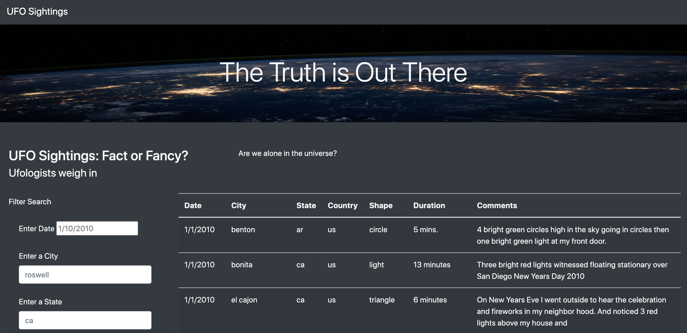

# UFO's Analysis | Interactive Webpage
Dana's goal is to create an interactive webpage that allows readers to parse the data around UFO sightings. 

## Overview of Analysis
 Dana’s webpage and dynamic table are working as intended, but this analysis will provide a more in-depth analysis of UFO sightings by allowing users to filter for multiple criteria at the same time. In addition to the date, we have added other table filters for the city, state, country, and shape.

### Purpose
Help Dana with her goal to create an interactive webage that allows readers to parse the data around UFO sightings.
Specifically, the purpose of the analysis is:
-  the webpage that will allow users to view the data (HTML)
-  a dynamic table that will present it (JavaScript).

## Results/Usage
Snapshot of the app

The left side of the page allows user to enter filter criteria for the following attributes: date, city, state, country, and shape. After entering all filter criteria, <Enter> should be pressed to view the result matching the filtered criteria.

## UFO's Summary
Dana's current design allows filtering data and does a good job if user knows it's data well. However, current web page has the following drawbacks and recommendations which should be fixed:
- All filter attributes doesn't have drop-down which makes it hard to find out what are the valid values. I tried to search by date and/or state only to get empty list. It would have been easier if there was a list available for each attribute.
- Data is coming from data.js file. It requires Dana to create this file every day. It would have been better to integrate with some service to get real-time data.

